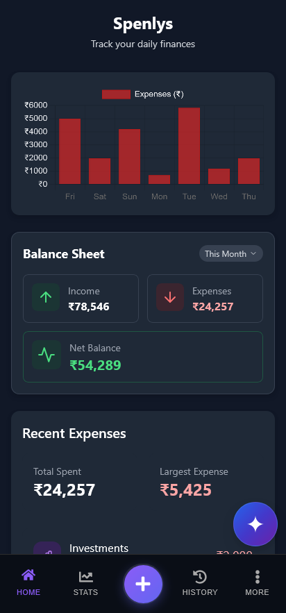
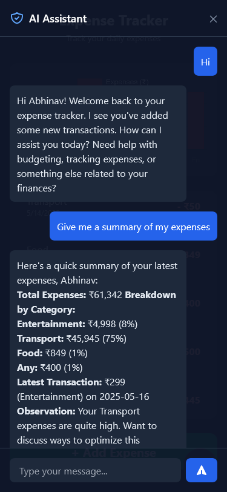
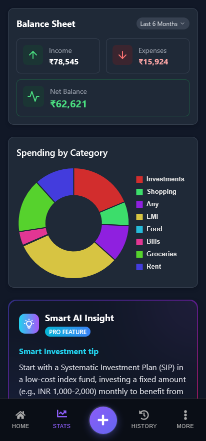
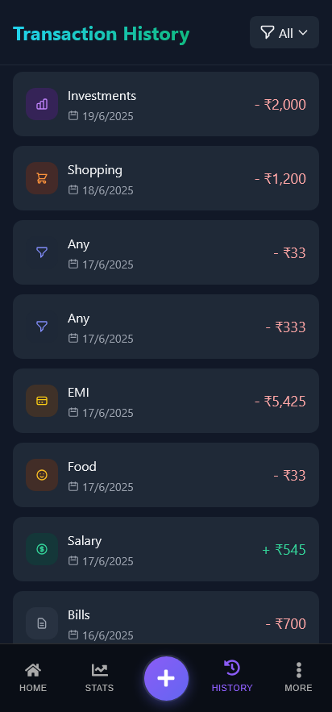
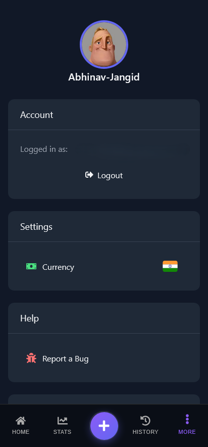
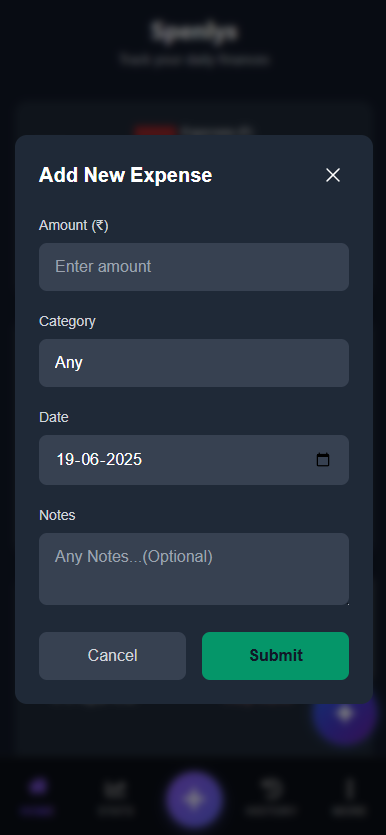

© 2025 Abhinav Jangid. All rights reserved.

🔒 This project is not open source. Usage, copying, or modification of any part of this project without permission is strictly prohibited.

# Expense Tracker App

Track your expenses effortlessly and stay in control of your finances.

## 🌐 Live Demo

[Try the App on Vercel](https://expense-tracker-app-gamma-nine.vercel.app)

## 📸 Screenshots

## ✅ Features

- Add and save expenses and income to the cloud
- GitHub and Google OAuth login
- Experimental AI assistant for insights

## 🚧 Known Limitations

- AI assistant may stop due to limited API credits
- Some bugs may arise

## 🔮 Coming Soon

- Recurring expenses
- AI upgrades (possibly premium)
- Better Stability

## 📜 License

© 2025 Abhinav Jangid. All rights reserved.  
This project is not open source. Usage, copying, or redistribution is strictly prohibited without permission.

## ✅ Feedback Welcome!

Any suggestions, issues, or feedback would be greatly appreciated. 🙌

_Made with ❤️ by Abhinav Jangid_
